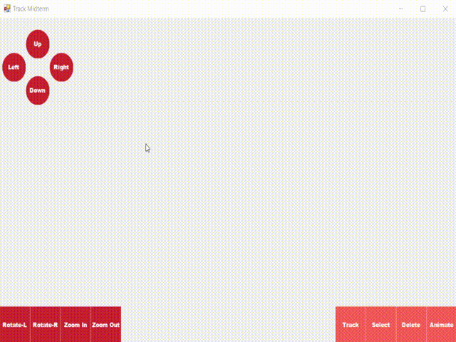
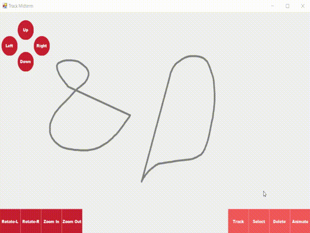

# Midterm Programmazione Interfacce Settembre 2019

Una soluzione per il midterm del corso di Programmazione interfacce dell'a.a 18/19.
Il progetto prevede due esericizi:

**Esercizio 1**
Si vuole realizzare un controllo grafico che consenta di disegnare dei tracciati su cui potranno correre “macchinine”. Il controllo dovrà mettere a disposizione dell’utente aree cliccabili per la trasformazione della vista (zoom, pan, rotate) e consentire la selezione dei vari tracciati disegnati per poterli spostare ed eliminare. I tracciati dovranno essere sempre chiusi, pertanto il controllo potrà sempre chiudere il tracciato al rilascio del bottone del mouse da parte dell’utente.

**Esercizio 2**
Si estenda il controllo dell’esercizio 1 per consentire di selezionare uno o più tracciati e, mediante la pressione di un’apposita area cliccabile, si animino oggetti che si muovano lungo le traiettorie indicate in parallelo e con velocità differenti selezionate casualmente.

**FIX** La traiettoria della "macchinina" bisogna che sia centrata nel tracciato.
